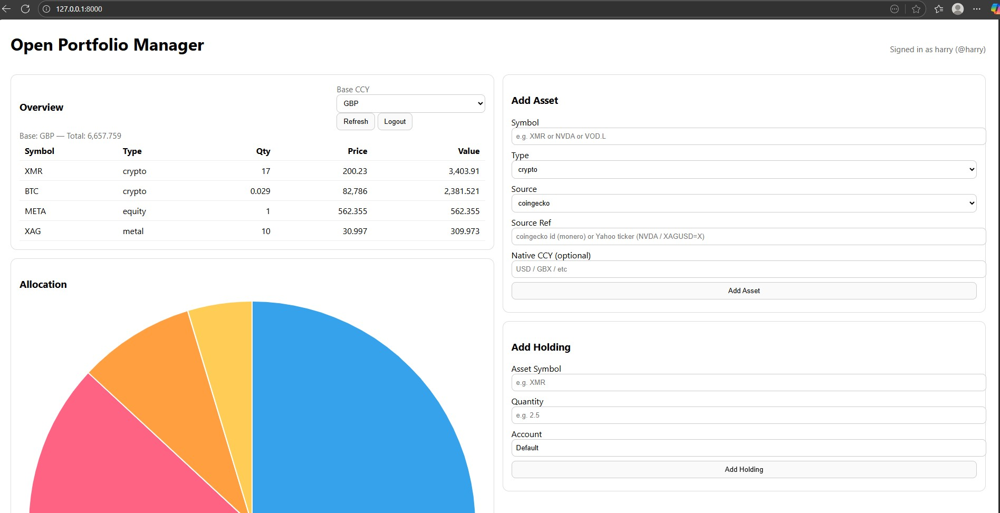

# Open Portfolio Manager

An open-source **personal portfolio tracker** for **crypto (BTC, XMR)**, **precious metals (Silver/XAG)**, and **stocks**.  
Built with **Python + FastAPI**, with plans for a simple web UI and CLI support.  

---

## ✨ Features (MVP)

- Track holdings across **crypto, metals, and equities**
- Fetch live prices:
  - Crypto: [CoinGecko API](https://www.coingecko.com/en/api)
  - Stocks: [yfinance](https://pypi.org/project/yfinance/)
  - Silver: XAG/USD via finance APIs
- Convert values into a base currency (GBP, USD, etc.)
- Portfolio overview with per-asset breakdown

---

## 🖼 Preview

Here’s a screenshot of the dashboard:



---


## 🧩 Project Structure

The app is compartmentalised into layers:

```mermaid
flowchart TD
    A[Frontend (UI)\nReact/Svelte (WIP)] <--> B[FastAPI API\n/overview etc.]
    B --> C[Core Logic\nPrice fetchers\nP&L calculations]
    C --> D[Database\nSQLite / MySQL]


- **Core logic**: independent Python code for fetching prices, storing transactions, calculating P&L.  
- **Backend API**: FastAPI exposing REST endpoints (`/overview`, `/transactions`, `/prices`).  
- **Frontend**: Web UI for dashboards and charts (to be built).  
- **CLI Tool**: optional, for terminal users.  
- **DevOps**: Docker Compose for easy setup, GitHub Actions for CI.  

---

## 🚀 Quick Start

Clone the repo:
```bash
git clone https://github.com/iblethebible/portfolio-manager.git
cd portfolio-manager


